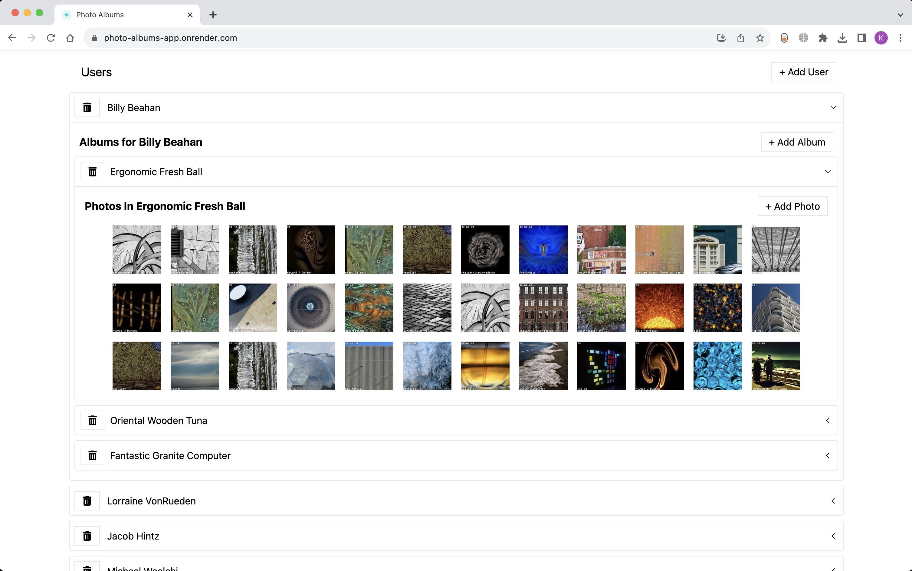

# Photo Albums App  

> A simple demonstration of my knowledge on reusable components like Accordions, Buttons, Panel, Thunks and many more using JSON server as back end and tailwind CSS for UI and ClassNames library for more customization of classnames and facker.JS for User data, album names and loremflicker for random images generated in the album.



This project is part of my proof of concept on React Redux, Reusable components, RESTful API, JSON server, DOM manipulation, Hooks, Slices and Thunks. Live demonstration of the application is deployed on Render, Please click here -> [Demo](s://kuladeepperumalla.github.io/Gaming-world---online-game-shop/) (Note: Due to the free hosting service, server loads after a minute! Thanks for your patience! <3 )


## Table of Contents

- [Introduction](#introduction)
- [Features](#features)
- [API reference](#API-reference)
- [Build Process](#build-process)
- [Developer](#Developer)


## Introduction

> Photo Albums App generates random users and users can add any number of photos generated from the API. (This App is built for POC purpose only)
- This is a single page web application where all the data is fetched and requests are made to API without reloding the page by using proide and invalidating tags.
- Used accordions to expand the data on click and add photos inside the expandable pannels
- Users, Albums, Photos can be Added and Deleted
- isLoading and isError used all accross the application to handle exceptions in case of bad server or 404 responses from the API
- Look into [features](#Features) for code snippets and more understanding.  

****

## Features

> A few of the things you can do with Gaming world:
> - Add/Delete Users by clicking button
> - Add/Delete albums
> - Add/Delete phhotos

****
## API Reference

> Add/Delete User

#### Get all users
```
  GET photos-albums-app-mockserver.onrender.com/users/
```
#### Post user
```
  POST photos-albums-app-mockserver.onrender.com/users/{id}
```

#### Delete user
```
  DELETE photos-albums-app-mockserver.onrender.com/users/{id}
```


| Parameter | Type     | Description                |
| :-------- | :------- | :------------------------- |
| `name`    | `string` | **Required**.              |
| `id`      | `number` | **Required**.              |


> Add/Delete Album

#### Get all Album
```
  GET photos-albums-app-mockserver.onrender.com/albums/
```
```
  POST photos-albums-app-mockserver.onrender.com/albums/{id}
```
```
  DELETE photos-albums-app-mockserver.onrender.com/albums/{id}
```

| Parameter | Type     | Description                |
| :-------- | :------- | :------------------------- |
| `userId`  | `number` | **Required**.              |
| `title`   | `string` | **Required**.              |
| `id`      | `number` | **Required**.              |

> Add/Delete Photos

#### Get all users
```
  GET photos-albums-app-mockserver.onrender.com/photos/
```
```
  POST photos-albums-app-mockserver.onrender.com/photos/{id}
```
```
  DELETE photos-albums-app-mockserver.onrender.com/photos/{id}
```

| Parameter | Type     | Description                |
| :-------- | :------- | :------------------------- |
| `albumId` | `number` | **Required**.              |
| `url`     | `string` | **Required**.              |
| `id`      | `number` | **Required**.              |


## 💻 Run Locally

Clone the project

```bash
  git clone s://github.com/kuladeepperumalla/photo-albums-app.git
```

Go to the project directory

```bash
  cd photo-albums-app
```

Install dependencies

```bash
  npm install
```

Start the backend server

```bash
  npm run start:server
```
Start the front end server

```bash
  npm run start
```


---


## Developer

This project is brought to you by  [Kuladeep Perumalla](s://github.com/kuladeepperumalla)).
